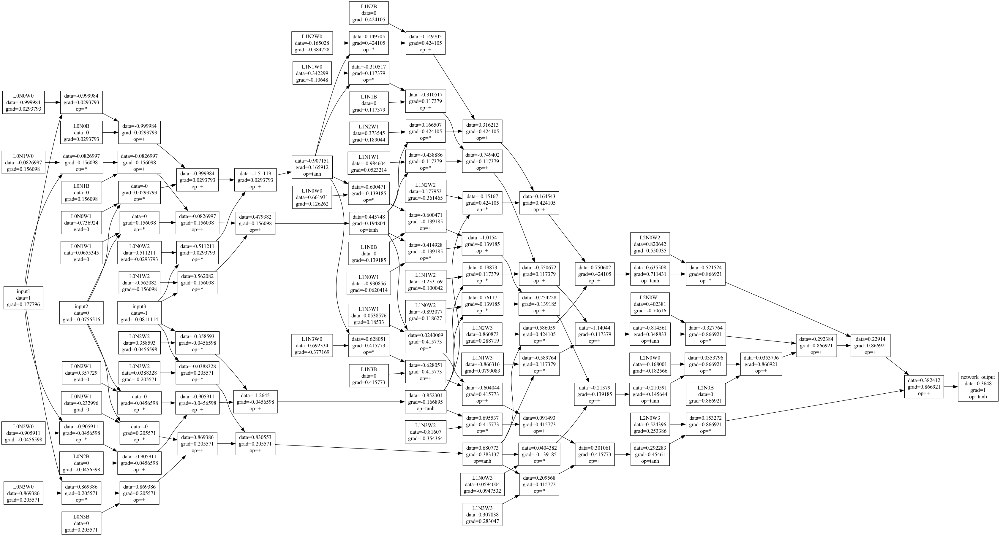

Neural Network framework using a simple scalar autograd engine in C++

Designed to be similar to have interfaces similar to the PyTorch library,
except that we do not have GPU support, advanced optimizers, or tensor support.

## Setup:
We don't use any libraries beyond the C++ standard library. If you'd like to visualize the computation graph via PNG, you'll need to have Graphviz installed.

- Requires C++20
- Requires Graphviz installed for PNG output (optional)
  -  `brew install graphviz` on MacOS with Homebrew

# Build and Run:
```
make && ./main
```

If you'd like to toy around, edit `main.cpp` to create different network architectures and inputs.


Example visualization of computation graph for a fully connected network with 3 inputs, 2 hidden layers of 4 neurons each, and 1 output:



## Future Work:
- extend to tensors
- optimize computational graph by minimizing intermediate nodes
- implement different layer types (convolutional, recurrent, etc)
- add python bindings

